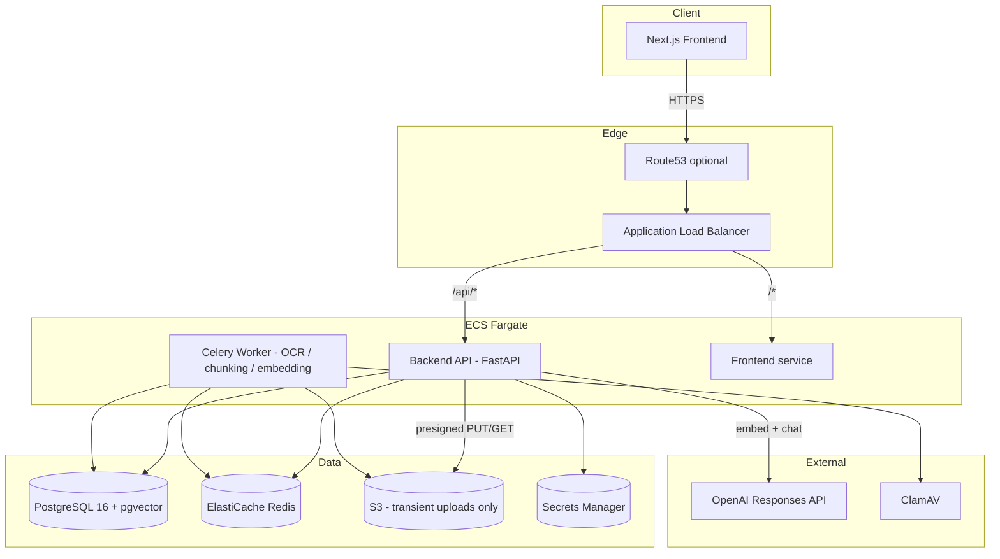
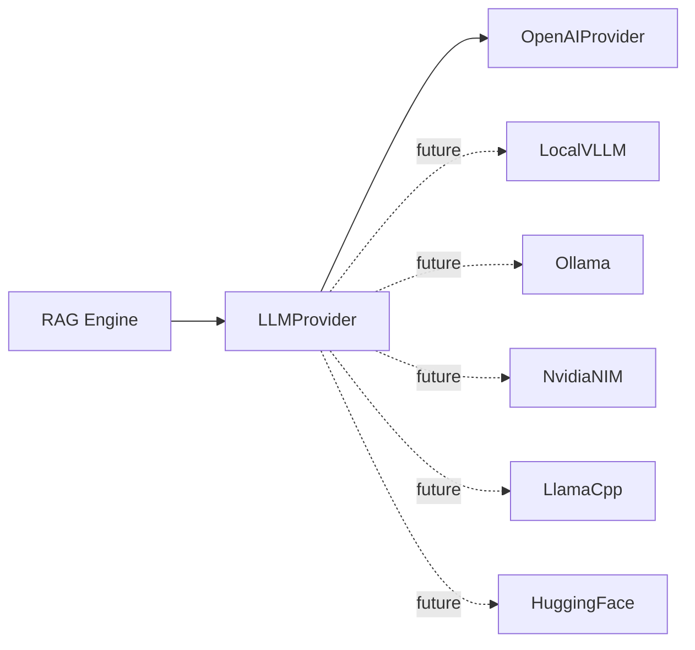

# Architecture

## System overview



## Request-time paths

**Chat (RAG)**: browser to ALB to backend API, embed question via
LLMProvider, pgvector similarity search, context compression, prompt
assembly, stream from LLMProvider, persist ChatMessage + ChatCitation
rows, SSE back to browser. See `app/services/rag/engine.py`.

**Upload**: browser requests a presigned URL, uploads directly to S3
(bytes never transit the API), browser confirms, API verifies the object
exists, enqueues a Celery task, worker downloads, virus-scans, validates,
extracts text (format-specific extractor, OCR fallback for scanned
PDFs/images), chunks semantically, embeds in batches, writes
DocumentChunk rows, deletes the S3 original. See
`app/workers/tasks/document_processing.py` and
`app/services/embedding/pipeline.py`.

## Provider abstraction

Both the LLM backend and the text extractors follow the same pattern: an
abstract interface (`LLMProvider`, `TextExtractor`), a factory/registry
that is the only place branching on which concrete implementation to use,
and everything else in the codebase depending only on the interface. See
`app/services/llm/` and `app/services/extraction/`.



## Directory layout

```
backend/
  app/
    api/            # FastAPI routers (one file per resource)
    core/           # config, security, aws, rate limiting, usage logging
    db/              # SQLAlchemy engine/session, declarative base
    models/          # ORM models (one file per aggregate)
    schemas/         # Pydantic request/response models
    services/        # business logic: auth, documents, knowledge bases,
                      # chat, admin, plus llm/, extraction/, ocr/,
                      # chunking/, embedding/, rag/ subsystems
    workers/         # Celery app + tasks
  alembic/           # migrations
  tests/             # pytest suite
frontend/
  src/
    app/             # Next.js App Router pages
    components/      # chat/, dashboard/ presentational components
    hooks/           # TanStack Query hooks per resource
    lib/             # API client, SSE streaming client, formatting
infra/terraform/     # AWS infrastructure (ECS Fargate target)
.github/workflows/   # CI (test+lint+validate) and CD (build+push+deploy)
docs/                # this directory
```

## Key design decisions worth knowing

- **Citations are never parsed from the model's text output.** They come
  directly from the chunks that were actually retrieved and placed in the
  prompt (`app/services/rag/engine.py`). The `[1]`, `[2]` markers in the
  model's answer are only for the reader's benefit; the authoritative
  citation records are structural, not extracted.
- **The never-hallucinate rule is structural, not just a prompt
  instruction**: if nothing clears the similarity threshold, the LLM is
  never called. See `tests/test_rag_engine.py`.
- **Originals are deleted from S3 only after embeddings are durably
  written**, never before, and never on a failure path. Enforced in
  `app/services/embedding/pipeline.py` and covered by a dedicated test.
- **Refresh tokens are opaque, not JWTs** — only their SHA-256 hash is
  stored, and presenting an already-used one revokes all of that user's
  sessions (replay defense).
